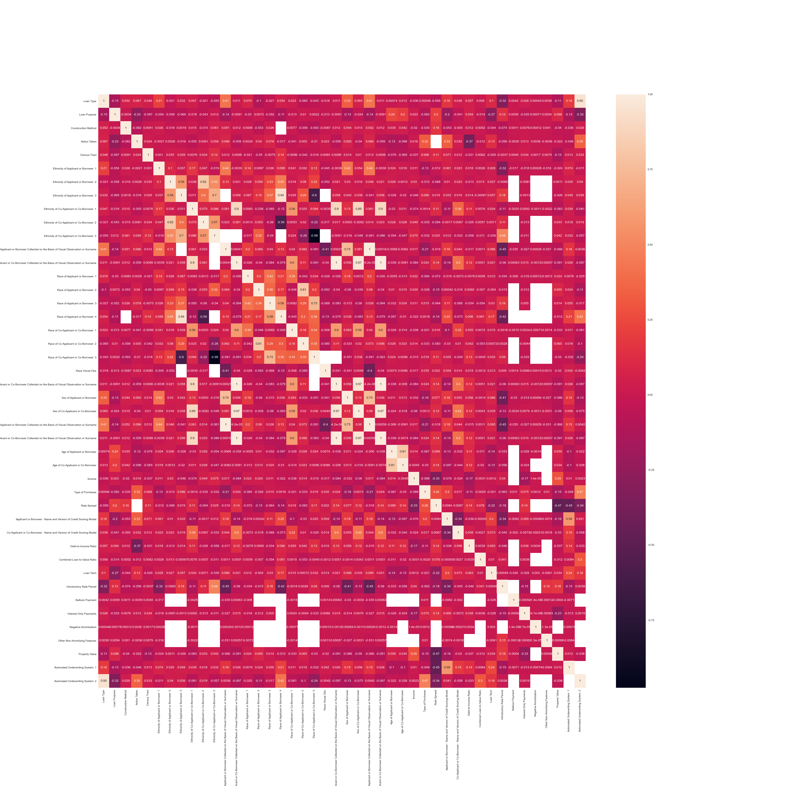
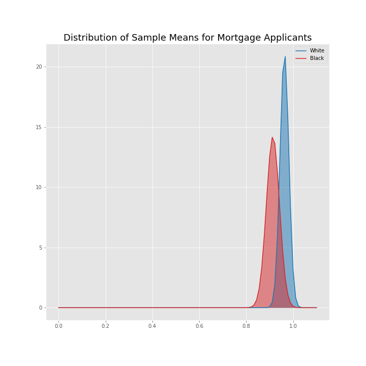
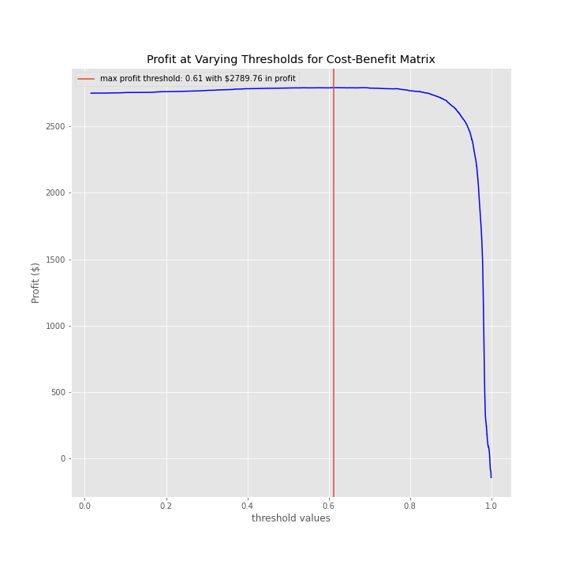
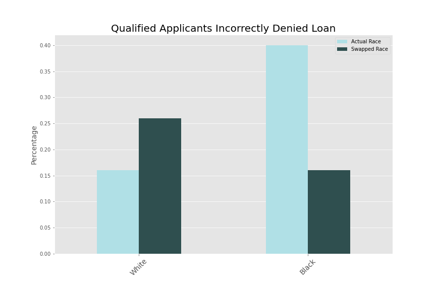

# Overview
In the U.S., systemic racism persists and acts as a barrier to protected classes. One of the most impactful ways to accumulate generational wealth is through home ownership. It’s widely known that computer models help humans make decisions - whether it’s what movie to watch, who to follow on social media, or who to approve for a home loan. In many cases, what businesses seek to do is use the hard, cold data to remove subjectivity. This aim is often well-intentioned: make more equitable decisions. However, computer models are only as good as the people creating them. Unintentional bias can creep in. Banking institutions specifically, and recently, have paid large settlements after they were found to have made biased lending decisions. 

In this project, I will attempt to create a predictive home loan approval model that accounts for racial bias, if present, and then create a web application that allows users to compare the liklihood of approval at several different banks, with transparency about model performance, protected class misclassification rate, and bank approval thresholds. 

I started the project with a deep exploration of data taken from Wells Fargo. I used this dataset to perform hypothesis testing and exploratory data analysis. Once I was satisified with my approach, I applied it to several other banks. My initial exploration can be found in the "Old Notebooks" folder. 

### Lending Institutions
The following banks were selected, as they [originated the most loans in 2019](https://www.housingwire.com/articles/here-are-the-top-10-mortgage-lenders-of-2019/), the same year data was pulled: 
* US Bank
* Bank of America
* Caliber Home Loans
* Loan Depot
* Fairway Independent Home Loans
* JPMorgan Chase
* Wells Fargo

# Datasets used
Several datasets were used in this project. 
The primary dataset was obtained from [FFEIC](https://ffiec.cfpb.gov/data-publication/documents#modified-lar). There were over 1 million rows and 58 columns. Data pulled was from Wells Fargo, but FFEIC offers the ability to pull data from other lending institutions as well. 

The second dataset was obtained from [USDA: Economic Research Service](https://www.ers.usda.gov/data-products/rural-urban-commuting-area-codes.aspx) and was used to map Census Tract IDs in the primary dataset, of which there were ~65,000 unique values, to 10 primary codes indicating whether the location was rural, urban, etc. Definitions of these location codes are found [here](https://depts.washington.edu/uwruca/ruca-codes.php).

The third dataset was obtained from [US Census](https://www.census.gov/geographies/reference-files/time-series/geo/gazetteer-files.2018.html), and was used to map latitude and longitude to census tract IDS. 

Additional datasets:

[Bank Climate Change](https://www.ran.org/bankingonclimatechange2020/)
* Small dataset that shows Fossil Fuel funding for 36 banks from 2016 - 2019. 

[Sustainable Finance Commitments](https://www.wri.org/finance/banks-sustainable-finance-commitments/)
* Dataset contains detailed overview of bank sustainability commitments, including, but not limited to: commitment amount, whether a timeline is provided and what the timeline is, description of the commitment, etc. 

## Dataset challenges
The data came with a few challenges. First, some banks approved loans more than the national average. The data is self-reported by the bank - some things could have been omitted for privacy purposes or other reasons. Or maybe this bank just markets to higher-qualified clientele. Why this discrepancy exists isn’t readily answered, so it’s worth noting. 

Credit scores, a big factor in approval decisions, had been scrubbed by the bank before I downloaded the data. However, several banks indicate the minimum FICO score needed for approval in their SEC 10K filings, so I might add this into the web application later. 

A month after I downloaded the initial dataset, FFEIC had updated variable names, so I had to redo all data pre-processing. There were additional "derived" fields added, which I used instead of manually condensing several high cardinality columns.

In some areas, the conforming loan limit is higher. I wasn't able to account for this in the web app.


## Omitted Data
Removed nearly all co-applicant information. It's well known that adding a co-applicant if you're approval likelihood is low will improve your chances, assuming the co-applicant is qualified. The only information about the co-applicant was protected classes. However, I wanted a simple user input form for the web app. Will use feature engineering to add "co-applicant minority race, gender, ethnicity" and "co-applicant present" in the future.

Only residential, first lien, single-dwelling loans were included. No refinances, reverse mortgages, or commercial loans were included. 

# Data Preprocessing
The data contained categorical, ordinal, and continuous variables. Prior to exploring the data, I performed some general dataset cleanup: 

__*Null Values*__

Because a goal of this project is to streamline data pre-processing, I did a deeper dive into how to handle missing values. According to Yiran Dong and Chao-Ying, a missing value ratio of up to 5% does not affect the bias of the dataset. According to Paul Madley-Dowd, Rachael Hughes, KateTilling, Jon Heron, a missing value ratio of up to 10% is acceptable, so long as the data is missing at random. 

* First, I created a function that would calculate the missing value ratio of all columns and dropped null values that comprised less than 5% of the dataset. 
* Next, I looked at the remaining features with missing value ratios above 5% to determine if values were missing at random. To do this, I created dataframes comprised of the rows containing missing values for each of the features over the acceptable missing value ratio threshold. Then, I compared the summary statistics for each of these dataframes with the summary statistics for the original dataframe. I focused on the mean and the standard deviation. Overall, the missing value subset for census tract, applicant sex, and applicant race-1 showed that the mean and standard deviation were fairly similar across all fields of interest. 

    ***Conclusion: data appears to be missing at random.***

Because I was crunched for time, I wound up dropping many more null values than the literature indicated I should. However, I did compare model performance before and after dropping these values and there was nomimal change. For some missing values, I chose to impute the median of the column, as the average was skewed by outliers in some cases. In other cases, I elected to use the mode. These choices are documented in the Mortgage Lending Jupyter Notebook. Future work includes a more careful handling of missing values. 

__*Categorical Variables*__

I used ordinal encoding for the age column because because there is a ranked order between age groups.  

Debt-to-Income Ratio column: there were both integers and ranges. It seemed odd to have the ratios broken out this way, so I'm assuming these values are important for mortgage, point for point, above a certain threshold. For this reason, it seemed important to keep the individual values between 36-50%. For the interval values, I encoded these to be the median of the interval. 

*Multicolinearity*

After initial preprocessing, I ran a few baseline machine learning models. The recall score was 100% which indicated there could be data leakage and/or overfitting. I dropped several additional features after confirming that they were associated with the target. For example, 'Reason for Denial' was only nan for loans that were approved, whereas 'Origination Charges' were only nan for loans that were denied. 

I generated a correlation matrix with the remaining features and created a dictionary that listed the colinear features with a value greater than 0.75. I then compared these pairs against the correlation with the target using crosstabulation and dropped the feature that was less correlated. 

<p align="center" >

</p>

# Hypothesis Testing 
Prior to exploring the data, I created a few hypotheses and set my alpha value at 0.05. 

### __Hypothesis Test 1: Comparison against national average__

H<sub>0</sub>: Applicants are approved at a rate lower than 92% if their race is not black.

H<sub>a</sub>: Applicants are approved at a lower rate if their race is not white. 

p-value: 0.88

Conclusion: Fail to reject the null hypothesis

### __Hypothesis Test 2: Comparison against dataset average__
H<sub>0</sub>: Wells Fargo applicants are approved at a rate lower than the average if their race is not black.

H<sub>a</sub>: Wells Fargo applicants are approved at a lower rate if their race is not white. 

p-value: 1.0

Conclusion: Fail to reject the null hypothesis


### __Hypothesis Test 3: Using a two-sample test to compare approval rates for white and black applicants:__

H<sub>0</sub>: White applicants are approved for mortgages at a higher rate than black applicants.

H<sub>a</sub>: Black applicants are approved at a lower rate than white applicants.
p-value: 0.06

Conclusion: Fail to reject the null hypothesis
<p align="center" >

</p>

# Exploratory Data Analysis
## Observations
* Might need to standardize dataset for geographic region
    * For example, CA makes up 15% of the data, after dropping irrelevant information
* Dataset imbalance: 
    * The dataset contained class imbalance both for the target variable and with the race variables. 

# First Model
### Metric Choice - Recall
In choosing which metric to optimize, I considered what it might cost lenders to miss out on a qualified applicant and assigned a "risk" value to lending to an unqualified applicant. 
* When interpreting model, select or create a profit measure 
    * Average ROI for lenders - what would missing out on qualified applicants cost? How much missed revenue?
        * Assume an interest of 3.5%, 30 year fixed mortgage
    * What is the cost of lending to an unqualified applicant? 
        * Average foreclosure rate
        * Average percent loss if goes to foreclosure

According to the [FDIC](https://www.fdic.gov/about/comein/files/foreclosure_statistics.pdf), the average lender loses approximately $50,000 per foreclosure, and approximately 1 in 200 homes will go to foreclosure. While this is an oversimplification, for the purpose of this study, I'll assume that a loan granted to an unqualified applicant (false positive or type II error) will have a potential cost of $50,000. 

In 2018, the [median home price](https://www.housingwire.com/articles/average-imb-made-over-5500-in-profit-per-loan-in-q3/) in the US was approximately $255,000. Assuming a 30 year mortgage, interest rate of 3.5%, and [average down payment of 6%](https://www.rocketmortgage.com/learn/what-is-the-average-down-payment-on-a-house#:~:text=The%20average%20down%20payment%20in,loan%20or%20a%20VA%20loan.), using an online calculator, the total interest paid over the life of a loan is $147,789.64. For simplicity, I'll assume lenders make an average profit of approximately $145,000 per loan. 

| Positive      | Negative|
| ----------- | ----------- |
| TP: predicted approved actually approved + $145K | FP: predicted approved actually denied -$50K|
| TN: predicted denied actually denied -$0  | FN: app predicted denied was actually approved -$145K|

Considering the lost revenue opportunity is greater than the cost risk associated with approving an unqualified applicant, I initially chose to optimize recall, which is used to minimize false negatives. While I was approaching this question from a purely financial lense, minimizing recall might also help negate bias against unprotected classes of people. 

## Subsetting the dataset for model training
After data preprocessing, there were approximately 700,000 entries. After attempting to run a few baseline models overnight, I found this to be too computationally expensive and decided to select a subset of the data by taking every 200th entry, resulting in 1,994 entries. I verified that the class distribution was approximately the same as with the original dataset. The training subset yields ~ 148 entries per feature, and the testing subset ~ 44 entries per feature.

## Baseline models produced the following recall scores:
|Model Used |Subset scores| Full test set scores|
| --------------| --------------| ----------------------------|
| SGD Classifier  | 94.28%     |94.24%
| Random Forest    |99.65%     | 99.74%
| Logistic Regression  |98.33%  | 97.91%

<br>

While these numbers look promising, I was still concerned about overfitting. I reran the correlation matrix and called the ```feature_importance``` method from the ```RandomForestClassifier```. Using the top features and cross-tabulation, I checked for perfect predictors and then dropped additional variables. 

Other models considered, but took too long to run: 
* KNN
* Gradient Boosted Trees

Linear Regression not considered because of high multicolinearity

## First Model Metrics
The final model had ~97.5% accuracy. False positives occurred at a rate of 2.3%, false negatives at 0.18%. 

# Final Model
While I had already implemented a Random Forest model in the first run through Wells Fargo data, I decided that for the purpose of the web app, I wanted the model to be more easily interpretable. Using Logistic Regression, I wasn't able to get a model to converge. Logistic Regression uses gradient descent as the solver, which looks at every sample in the dataset at every iteration. Stochastic Gradient Descent looks only at one sample at a time, making it much faster for large datasets (greater than 100,000 observations) and with sparse matrices. I used the ```SGDClassifer``` in ```sklearn``` and tuned the model using a gridsearch with cross-validation. 

*Handling Class Imbalance*: 
* Metric selection: F1 Score
    - Training a model on accuracy will simply predict the majority class in an imbalanced dataset. Balancing precision and recall is the better choice here, because it looks at the fp and fn values.
* Stratified target sampling in train-test-split
* Threshold moving with decision rules: I used a confusion matrix and cost-benefit matrix to determine the classification threshold that would produce the highest profit for each bank. Details below. 

## Metrics for Threshold Determination for each bank:
*  **True Positives:** applicants who were predicted approved and were actually approved 

    The actual profit a bank makes per loan is very difficult to calculate and involves a number of factors. The most common way that the lender makes a profit is by selling the loan to an investor. According to an industry expert, the net profit from the sale of a loan is approximately 1% of the loan amount. I set this value for each lender by taking 1% of the average loan amount in the dataset. 
* **True Negatives:** Because I was not including the costs of marketing, advertising or other overhead costs, I set this value to 0. 
* **False Positives:** applicants predicted approved but were actually denied

    The risk in this situation is that the lending institution might have to buy this loan back from an investor, negating their profit, and potentially damaging that relationship. It was difficult to assign a value to a damaged relationship, so I arbitrarily chose 0.5% profit drop. This happens rarely in practice because each loan goes through underwriting and the information fed into the model is verified. Initially, I considered multiplying this value by 1.16%, which is the average foreclosure rate in the US. However, I elected to keep equal to the loan profit multiplied by 1.05% because this value is used to optimize the model, not the bank's next steps. 
* **False Negative:** a qualified applicant is incorrectly denied a loan

    For this value, I used the opportunity cost of missing out on a good loan multiplied by the bank’s residential mortgage market share, because even if the model approved the applicant, it’s not a given that they would sign with that bank. To estimate market share, I used a 2018 report from [S & P Global](https://www.spglobal.com/marketintelligence/en/news-insights/blog/tech-in-banking-an-age-of-digital-disruption)

## ***Example cost-benefit-matrix (Wells Fargo)***


| Positive      | Negative|
| ----------- | ----------- |
| TN: $0 | FP: -$3027|
| FN: -$149  | TP: $3016 |

Using and array of predicted probabilities, I used each probability as a possible approval threshold and calculated the profit by finding the sum of the matrix product of the cost-benefit-matrix and the confusion matrix for each threshold. I plotted the resulting profit curve and found the threshold at the index that corresponds to the highest profit value for each bank. 

<p align="center" >

</p>


# Evaluating for Bias
In addition to Hypothesis Testing for racial bias in approval rates, I explored denial rates. I focused specifically on Type II errors, which carry the most weight both for the lender and for the applicant. For lenders, a type II error means missed revenue. For applicants, it means missing a huge investment. 

## Process
First, I looked at the rate at which these errors were occuring for white and black applicants in general. False negatives occured at 0.16% for white applicants and 0.40% for black applicants.

Next, I created a copy of the dataset and coded all black applicants as white and all white applicants as black. All other variables were kept the same. Then, I tested the model on the new dummy dataset. 

When white applicants were coded as black, their false denial rates increased by a tenth of a percent. 

When black applicants were coded as white, their false denial rates decreased. Interestingly, the denial rate after the swap is 0.16% - the same rate at which white applicants are incorrectly denied a loan. While there is not evidence of causation, it is interesting that changing a black person’s to white seems to level the playing field,  whereas changing a white person’s race to black does not increase the false denial rate to that of black applicants. This shows that there could still be variables embedded in the dataset that indicate race. 

<p align="center" >

</p>

# Web App Development
### Objectives
* Create an app that predicts the likelihood of approval for ten banks, show approval threshold, bias error metrics, climate policy scores, model performance
* Allow users to filter results by environmental stewardship and equitable lending rank, and by loan term conditions
* Compatability issues/updates needed in the future
    - column name changes
    - different inputs for each model, to streamline this, tried running models without certain features that would be difficult or impossible to gather from a user:
        - type of underwriting system
        - race/ethnicity observed by the banker
        - little to no effect on model performance after these deletions (less than a 2% change)
        - Conforming loan limit changes annually, new bank data released annually, census tracts redrawn 
# Scalability
Initially, I planned to create models that were customized for each bank. This meant I would drop features based on the same criteria: percentage of null values, etc. However, this created compatability issues with the web application because there were some features that were used in an approval decision for one bank model that were not used in another. I decided to drop the same features for all banks, and re-ran every model to see how performance changed. In all cases, performance was within +/- 4%, which was an acceptable range for me if it meant the app would be more palatable to users. 

Now that I've made this decision, I'll be able to automate nearly all of the data preprocessing required, making it easy to incorporate new lenders. The files in the ```src``` folder are NOT yet complete, and the notebooks for each bank are nearly identical. In the future, this process will be streamlined. 
# Future Exploration
There is still plenty to be explored on this topic. I would like to: 
 * include additional lenders in the web application
 * re-run the model after dropping all race variables to see how it affects the model accuracy. 
 * try adding a correction factor after the model has run to see if this could be used to offset bias. 
 * use this dataset to predict race instead of loan approval, so I could then look at what the top variables were in determining race and account for those in the loan approval model. 
 * Dockerize the app and deploy via AWS

 I might also explore the following topics for bias: 
* Pre-approval rates
* Business loan approval
* Reverse mortgage approval

